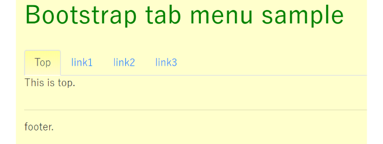

# bootstrap_tab_menu_sample

## Description

Tab menu sample html and css by Bootstrap.

## Execution

  
[Here.](https://hiroshikuze.github.io/bootstrap_tab_menu_sample/)

## Reference

[とほほのBootstrap 4入門 - ナビ](http://www.tohoho-web.com/bootstrap/navs.html "とほほのBootstrap 4入門 - ナビ")

## Contribution

1. Fork it ( http://github.com/hiroshikuze/bootstrap_tab_menu_sample/fork )
2. Create your feature branch (git checkout -b my-new-feature)
3. Commit your changes (git commit -am 'Add some feature')
4. Push to the branch (git push origin my-new-feature)
5. Create new Pull Request

## LICENCE

[MIT License.](./LICENSE)

## Author

[hiroshikuze](https://github.com/hiroshikuze)

## Donation

[Author's wish list by Amazon(Japanese)](https://www.amazon.jp/hz/wishlist/ls/5BAWD0LZ89V9?ref_=wl_share)
